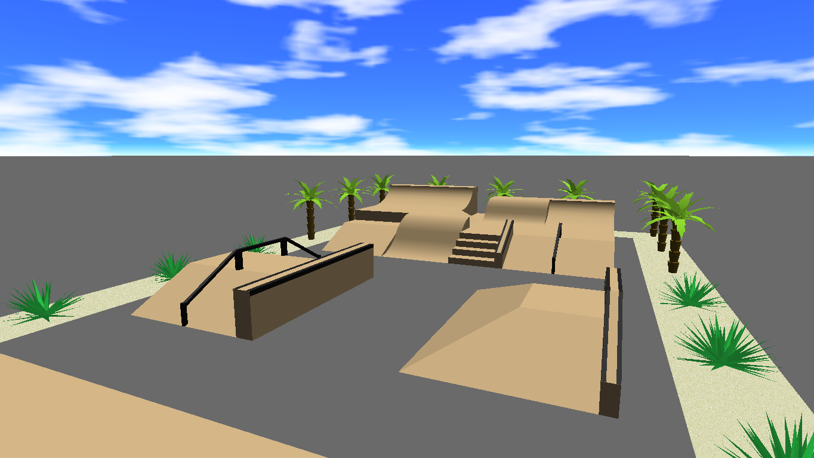

# Skatepark3D
A 3D skatepark viewer written in C++ and OpenGL.

## How to use it
1. Build & run the application.
1. Enter the location of the XML file describing a skatepark. Some samples can be found in the folder *parks*.

Controls:
* Arrows: rotate view
* X, Y: zoom in, zoom out
* Esc: exit
* Q, E: lift view up/down
* F: toggle fullscreen
* G: toggle wireframe mode
* H: toggle grid
* S: take a screenshot
* Esc: exit

